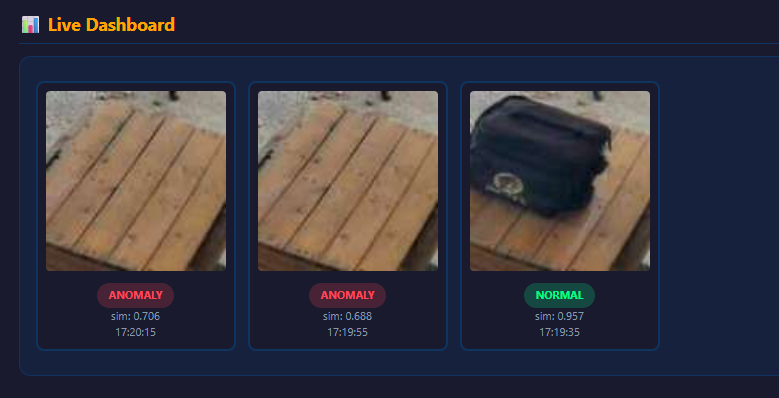

# 🦖 Anomaly Detection for Frigate

**version 0.0 — proof of concept.** Don't get attached.

A dumb little tool that runs **zero shot anomaly detection** on a Frigate camera feed. It grabs a picture from your camera, compares it to a "normal" baseline that you set, and lets you know (via logs, and optionally MQTT) when something looks weird.

This is the proof of concept version. This will likely be only minimally maintained as proof that zero shot anomaly detection is extremely easy.

---

## ? WHY

When you already have data, there are better options. Zero‑shot is what you use when data is limited or non‑existent.

One educated guess for confidence and you suddenly have a smart detector. No training, no labeling, no dataset prep. Just define “normal” once and let the model handle everything else.

---

## What it does / doesn't

✅ **Does:**
- Pulls snapshots straight from the Frigate API (no auth, local use).
- Lets you pick a camera, draw a zone, and capture baselines.
- Keeps a **baseline library of up to 40 images**, so your "normal" is more than one lucky snapshot.
- Runs the DINOv2 vision model through **OpenVINO only** (iGPU/CPU — no CUDA drama).
- Gives you basic filtering and interval sampling, speeding up whenever an anomaly is actually brewing.
- Includes a tiny dashboard so you can see what it's flagging.
- Runs as **one instance** — single camera, zero swag.

❌ **Doesn't (yet):**
- No multi-camera, no docker-compose, no auth, no Home Assistant integration.
- No GPU-vendor hopping. It's **OpenVINO or nothing**.
- Nothing fancy at all, honestly. It's v0.0. Manage your expectations.

---

## Quickstart (seriously, 4 steps)

```bash
# 1. Clone it
git clone https://github.com/tylerransdell/frigate_anomaly && cd frigate_anomaly

# 2. Make a venv & install
python3 -m venv .venv && source .venv/bin/activate
pip install -r requirements.txt

# 3. Run it
python3 server.py                # web UI at http://localhost:8080
# or, if 8080 is taken:
python3 server.py --port 9090
```

That's it. On the first run it converts and compiles the model (OpenVINO), which can take a minute or two — be patient. After that, it's fast.

---

## 🧪 A Photo



---

## 🐎 Throughput

About **35ms per inference** on a **Meteor Lake** iGPU with the **half (224) model**. That's fast enough to sample every couple of seconds without breaking a sweat. The console shows inference and fetch times.

---

## 🎯 How It Decides (k-NN)

This is textbook **k-nearest-neighbors** on the baseline library:

1. Every captured baseline is turned into an embedding — a compact vector fingerprint of the scene.
2. Every live snapshot becomes an embedding too, then gets scored against your whole **baseline library (up to 40 images)**.
3. Pick the method: score against your **single nearest neighbor** (k=1) or the **mean of the top 3 nearest** (k=3 / "mean of top 3").
4. That similarity hits your **Anomaly Threshold** — under it, it's an anomaly; at or above it, normal.

The baseline dashboard previews each image's confidence (its own nearest-neighbor similarity), so you can spot duplicates or outliers in your "normal" set before they skew detection.

---

## 🕹️ Using It

1. Open the web UI (usually `http://host:8080`).
2. Enter your Frigate URL, like `http://192.168.1.x:5000` — **no auth yet**, so just make sure it's reachable on your LAN.
3. Click **Fetch Cameras**, then pick your camera.
4. Click **Load Camera Snapshot** so you can actually see what the camera sees.
5. Tweak **Model Area** (Half 224 / Full 518) and **Crop** (0.5× / 1.0× / 2.0×) to your taste.
6. **Click-drag** a box on the image to select the zone you care about.
7. Click **Capture Baseline** — that's your "everything is normal" picture. Keep adding snapshots to the **Baseline Library** (up to 40) to cover more normal variety; you can pull them straight from the live dashboard too.
8. Pick a **Similarity Method** — **Nearest 1** scores against your single closest baseline, or **Mean of top 3** scores against the average of your 3 closest (or however many you've saved). Same **Anomaly Threshold** line applies to whichever you choose.
9. Review the **Sampling & Duration** filters, and flip them on if you want.
10. Hit **Start Engine** and let it do its thing.
11. There are also MQTT alerts. Let me know if they work or I'll get around to it. 

> 💡 **Nearest vs. mean:** a perfect match to *one* baseline isn't necessarily a great match to the *mean* of the top few — if you only have 1–2 baselines, "mean of top 3" is really just the mean of those 1–2, so the two methods start agreeing. Gather ≥3 diverse baselines and the mean method really shines; with fewer, **Nearest 1** is often the more honest pick. 

---

## ♻️ Persistence & Startup

This is a standalone script, not a daemon yet. To keep it running across reboots, wrap `server.py` in a **system service** (e.g. a systemd unit) for now. A containerized (Docker) build may show up at some point, but it's **not** here today.

The inference engine will fire up automatically on startup, but only once everything it needs has been saved. Your prerequisites are:

- **Server** (Frigate URL)
- **Camera**
- **Detect area**
- **At least one baseline image** (the library holds up to 40)

Once all four are configured and saved, the engine starts on launch and does its thing.

---

## ✋ Fine Print & Caveats

- `server.py` compiles the OpenVINO IR once and caches it under `model_cache/`. If you delete that folder, it'll rebuild itself.
- Your settings live in `config.json` (git-ignored), and your baselines live in `baselines/` (also git-ignored). Both are just plain files on disk. Up to 40 baseline images, compared as the mean of the 3 nearest — they persist across restarts.
- **Honest warning:** there's no auth, no HTTPS, nothing. Run it on a trusted LAN and don't port-forward it.

---

## Roadmap (maybe)

Multiple detectors. Polish. Static container. Things like that.

## License

MIT. Do whatever you want, just don't blame me for anything.
